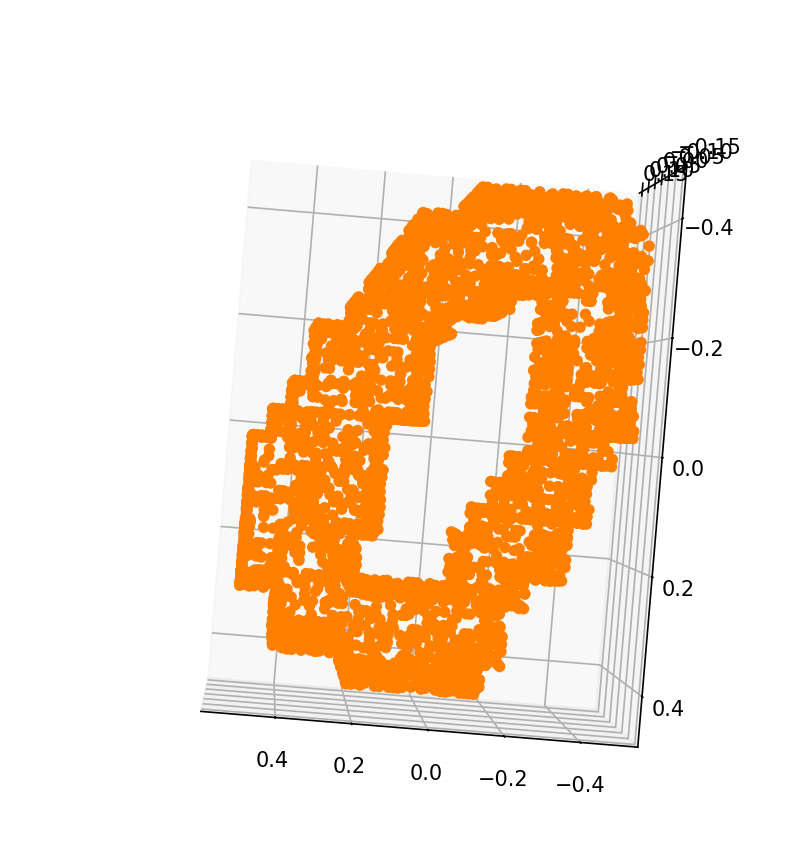

# Point Cloud Visualizer

This project is a simple 3D and 2D visualization tool for point cloud data stored in HDF5 (.h5) format. It's useful for quickly inspecting and plotting 3D point cloud datasets, especially those used in machine learning tasks such as digit recognition or object detection.

## Dataset Overview
The aim of this dataset is to provide a simple way to get started with 3D computer vision problems such as 3D shape recognition.

Accurate 3D point clouds can be easily and cheaply acquired from various sources:
- RGB-D devices: Google Tango, Microsoft Kinect, etc.
- Lidar.
- 3D reconstruction from multiple images.

Despite these sources, large 3D datasets are still rare, especially those based on raw point clouds—the native output from most 3D sensing devices.

This dataset was generated from the original MNIST images, providing a familiar introduction to 3D for practitioners used to working with 2D data. It includes both the original point clouds and augmented versions with noise and random rotations.

### Dataset Files
#### `train_point_clouds.h5` & `test_point_clouds.h5`
- 5000 (train) and 1000 (test) 3D point clouds in HDF5 format.
- Each point cloud is normalized to zero mean and unit scale.
- Organized into HDF5 groups named by sample index.
- Each group contains:
  - `points`: (x, y, z) coordinates.
  - `normals`: unit normal vectors (nx, ny, nz).
  - `img`: original MNIST image.
  - `label`: digit label (attribute).


#### `full_dataset_vectors.h5`
- Voxelized point clouds as 4096-dimensional vectors from a 16x16x16 voxel grid.
- Includes rotated and noisy versions.
- Contents:
  - `X_train`: (10000, 4096)
  - `y_train`: (10000,)
  - `X_test`: (2000, 4096)
  - `y_test`: (2000,)

## Features
- Load `.h5` point cloud data with labels.
- Downsample large point clouds for faster rendering.
- 3D scatter plot using `matplotlib`.
- 2D projection plot (XY plane).

## Installation
Make sure you have Python 3.x installed and run:
```bash
pip install numpy matplotlib h5py
```

## Functions Overview
### `downsample(points, max_points=500)`
Randomly reduces the number of points for visualization efficiency.

### `plot_points(xyz, colors=None, size=20, axis=False)`
Renders a 3D scatter plot of the point cloud.

### `plot_2d_projection(points)`
Displays a 2D projection (XY plane) of the point cloud.

## Sample Output


## License
This project is open source and available under the MIT License.

